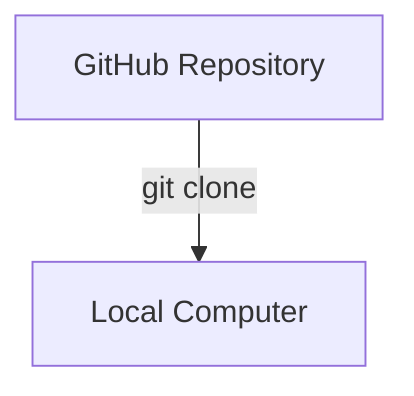
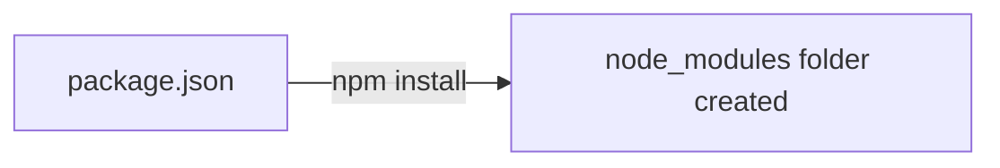

# Running Fr8OrdR from GitHub

## Prerequisites
- **Node.js**: Make sure you have Node.js (v18+) installed.
- **Git**: Ensure Git is installed on your machine.

## Illustrated Instructions

### 1. Clone the Repository
Open your terminal and clone the repository using the following command:
```bash
git clone https://github.com/qamotech/Fr8OrdR.git
```


### 2. Navigate to the Directory
```bash
cd Fr8OrdR
```

### 3. Install Dependencies
Run the npm install command to fetch all required libraries (React, Vite, Lucide, etc.)
```bash
npm install
```


### 4. Start the Development Server
```bash
npm run dev
```

### 5. Open in Browser
Your terminal will display a local URL (usually `http://localhost:5173`). Click it or type it into your browser.

> [!TIP]
> **Pro Tip**: If port 5173 is in use, Vite will automatically assign the next available port (e.g., 5174). Check your terminal output!
